

<!--=== TARTARUS ACCESS TERMINAL ===-->

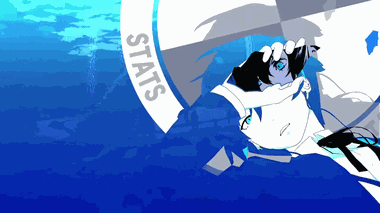

  

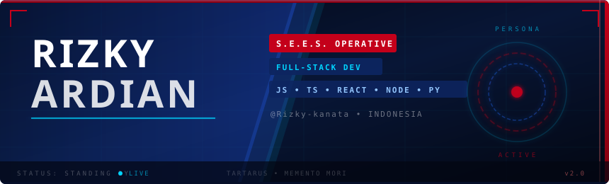

 

 

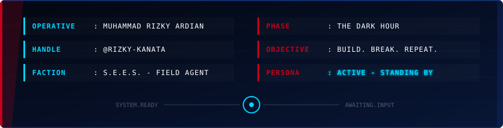

  

  

 

  
  
  
  
  

 

  
  
  
  
  

  

  

 

  

  

 

<picture>
  <source media="(prefers-color-scheme: dark)" srcset="https://raw.githubusercontent.com/Rizky-kanata/Rizky-kanata/output/github-contribution-grid-snake-blue.svg">
  <source media="(prefers-color-scheme: light)" srcset="https://raw.githubusercontent.com/Rizky-kanata/Rizky-kanata/output/github-contribution-grid-snake-blue.svg">
  
</picture>

 

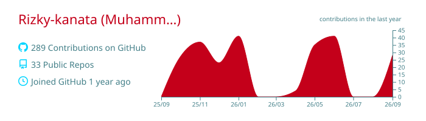

  

 

<a href="https://github.com/Rizky-kanata/Semantic">
  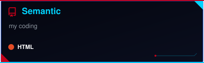
</a>
<a href="https://github.com/Rizky-kanata/Form">
  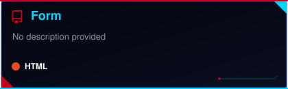
</a>

 

<a href="https://github.com/Rizky-kanata/modul-4">
  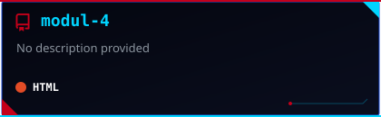
</a>
<a href="https://github.com/Rizky-kanata/modul-13">
  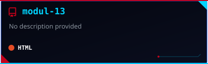
</a>

 

<a href="https://github.com/Rizky-kanata/modul-7">
  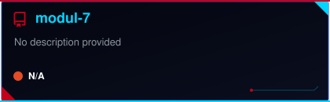
</a>

  

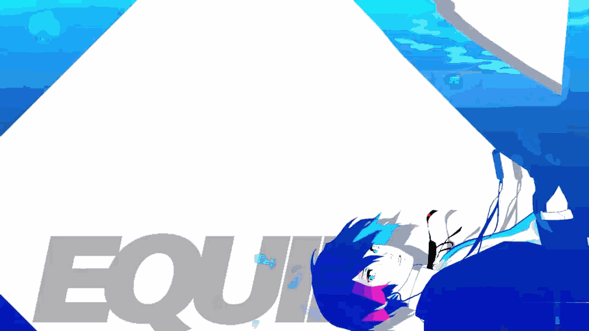

  

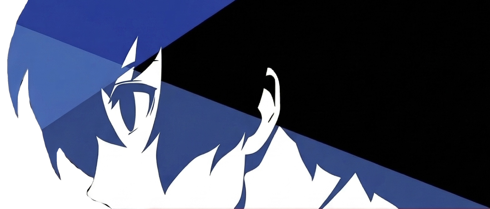
&nbsp;
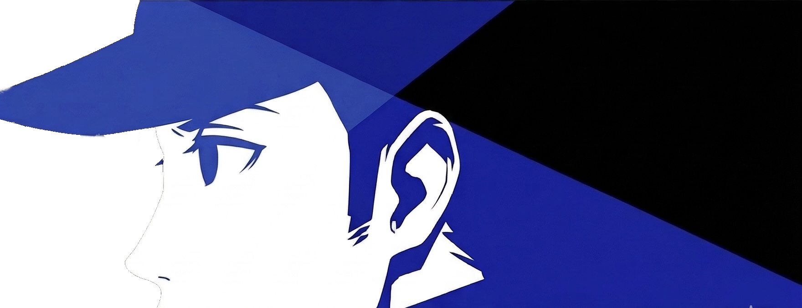
&nbsp;
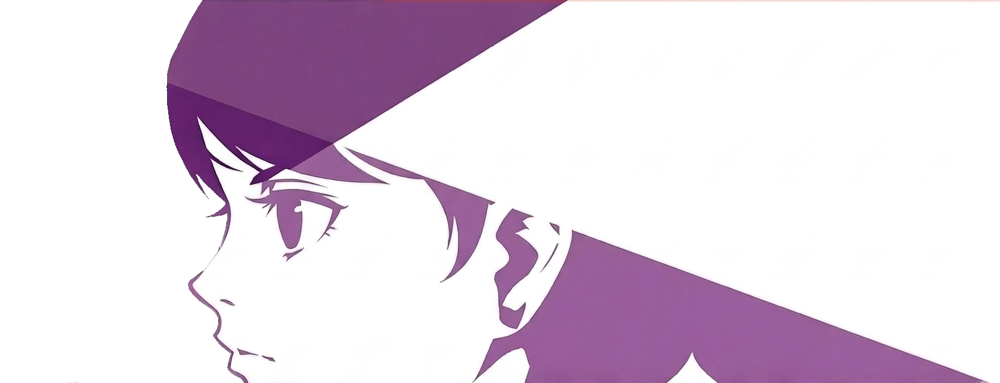

  

 

  

  

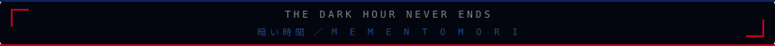

 

*🌙 The Dark Hour never ends for those who seek the truth. 🌙*

